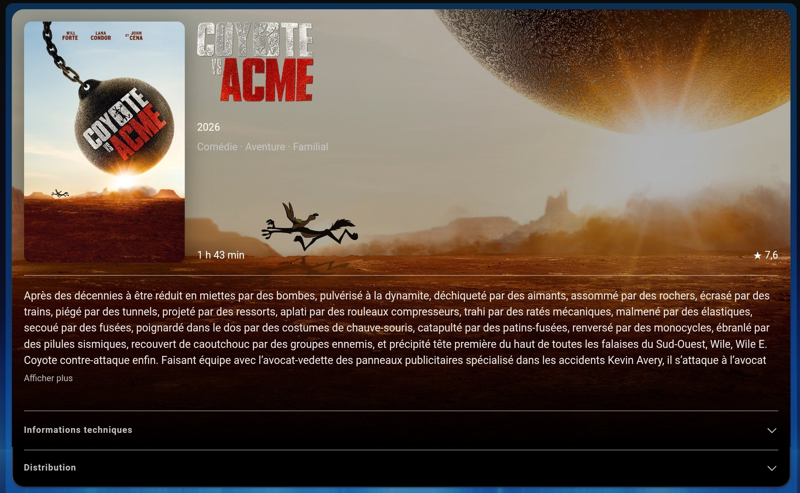
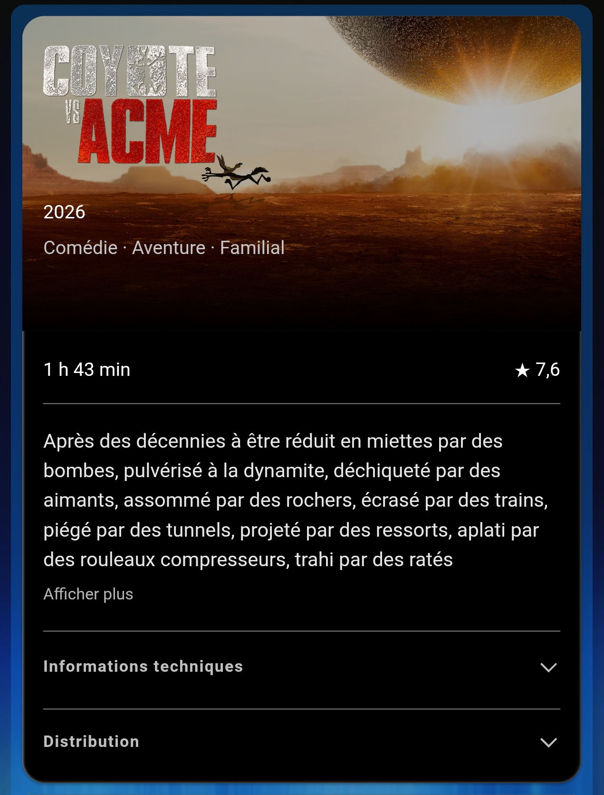
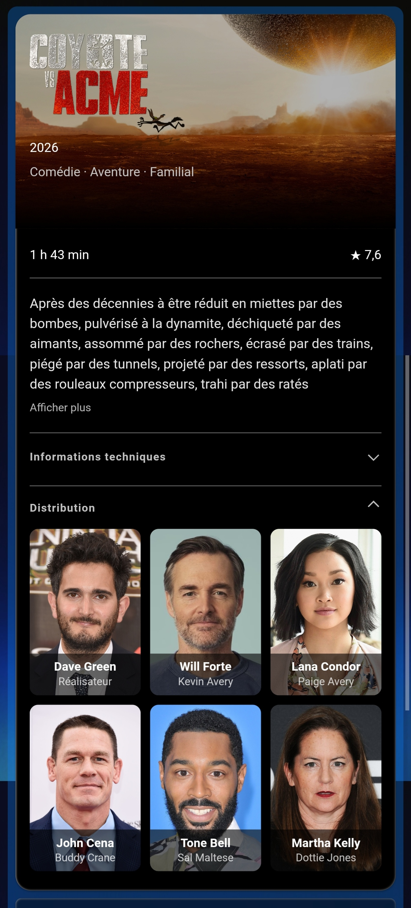
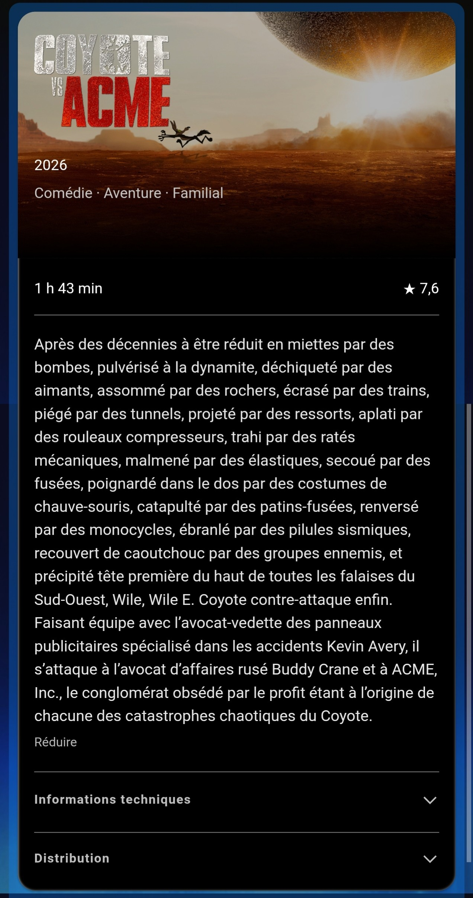
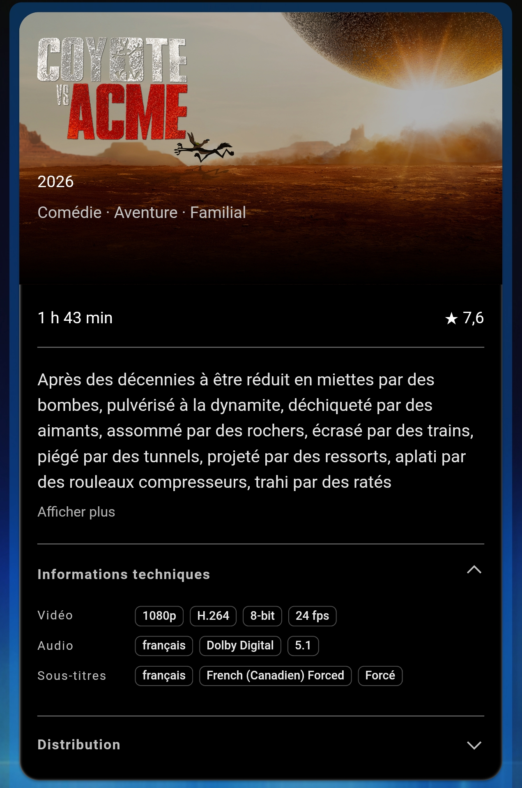
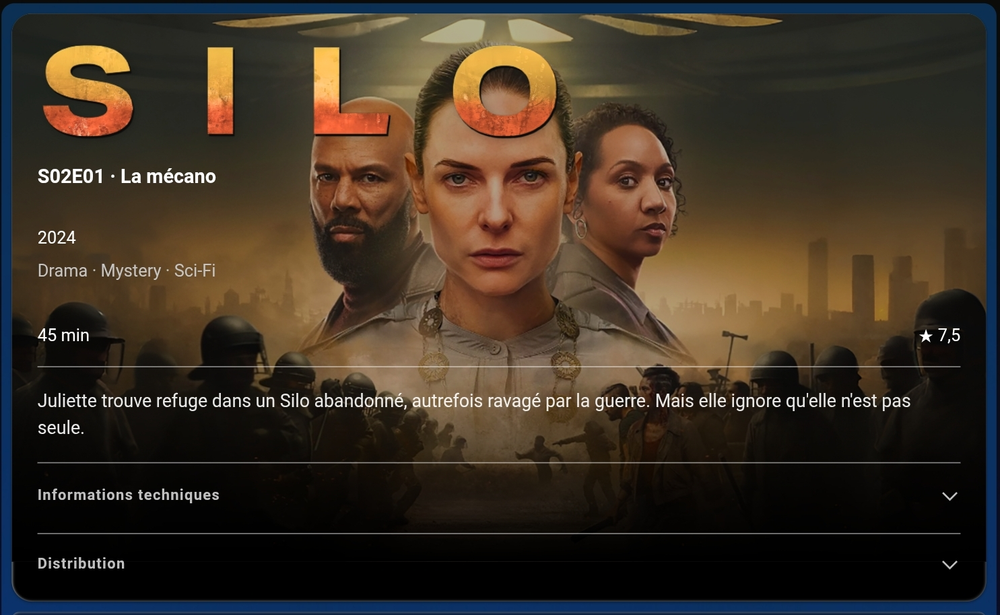
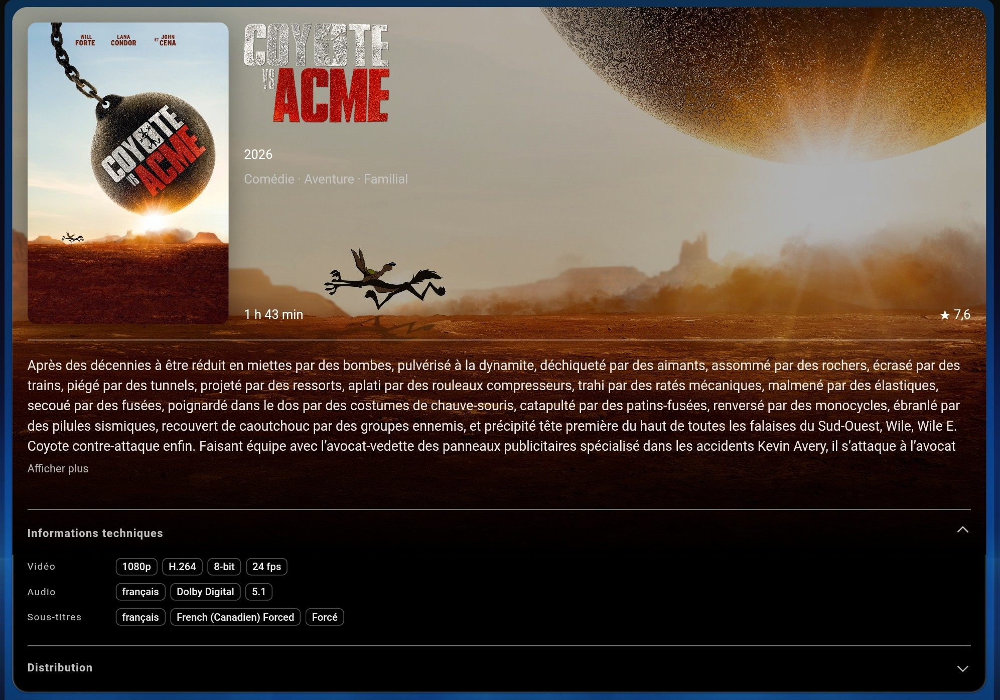
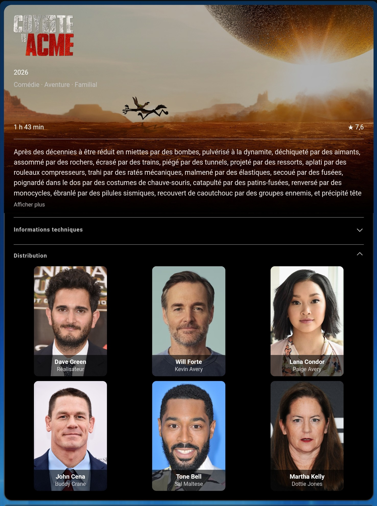
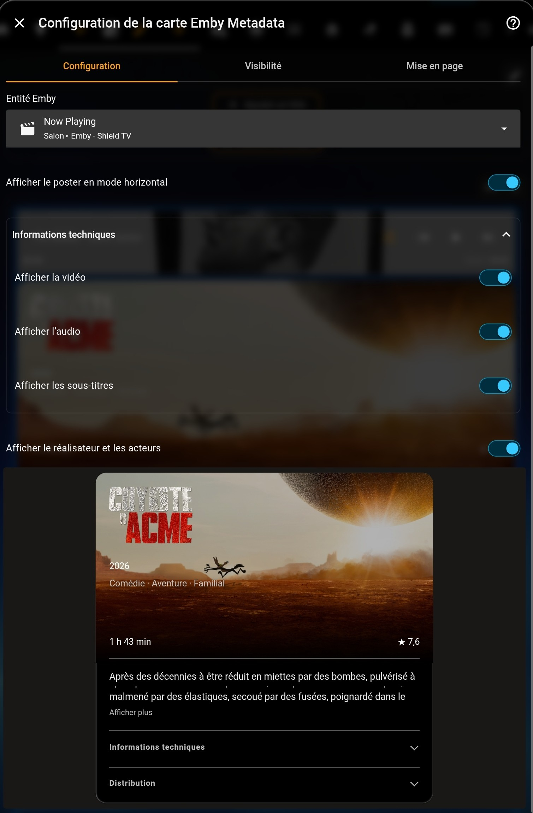

# Emby Metadata

A Home Assistant integration and companion dashboard card for media playing on an Emby client.




[Screenshots](#screenshots) · [Installation](#installation) · [Card configuration](#configuration)

## Features

- Movies, TV episodes and personal videos, using metadata available in Emby.
- Responsive layout at 768 px, optional poster, proportional backdrop and title logo with text fallback.
- Synopsis, rating, runtime, video, audio and subtitle information.
- Director and up to five actors with photos and fallback portraits.
- Animated sections: opening one collapses the others.
- English, French, German and Spanish, following the Home Assistant language.
- Images served by Home Assistant; the Emby API key stays on the server.
- Unchanged metadata does not rebuild the card.

## Screenshots

Real screenshots from Home Assistant on mobile and tablet. The examples use the French interface; the card also supports English, German and Spanish. Click an image to view it at full size.

### Mobile

<table><tr><td valign="top">
  <a href="docs/screenshots/mobile-synopsis-small.jpg"></a>
</td><td valign="top">
  <a href="docs/screenshots/mobile-actors.jpg"></a>
</td></tr></table>

Compact synopsis and expandable cast, with names and roles overlaid on portraits.

<details>
<summary>More mobile views: full synopsis and technical information</summary>

<table><tr><td valign="top">
  <a href="docs/screenshots/mobile-synopsis-full.jpg"></a>
</td><td valign="top">
  <a href="docs/screenshots/mobile-technical-data.jpg"></a>
</td></tr></table>

</details>

### TV episodes



Series artwork with episode-specific information. The poster is hidden in this example.

<details>
<summary>More tablet views: technical information and cast</summary>

**Video, audio and subtitles, with the poster enabled**



**Director and cast, with the poster hidden**



</details>

## Installation

### Before configuring a player

**The target Emby player must be active and connected to your Emby server to be detected.** Open the Emby application on that device, sign in and leave it open during setup. Powering on the device alone is not enough. Detection uses the server's active client sessions, not a list of all previously used devices.

If the player is missing, start playback briefly, then go back to the server connection step and submit it again to refresh the player list. Repeat this preparation when adding another player.

### Install and configure

1. Copy `custom_components/emby_metadata` into your Home Assistant `custom_components` directory.
2. Restart Home Assistant.
3. Open **Settings → Devices & services → Add integration → Emby Metadata**.
4. Enter your Emby protocol, host, port and API key, then select the client to monitor. Start the client if it is not listed.
5. The card resource is registered automatically when resources are managed through the UI. Reload the browser after restarting. For YAML-managed resources, add this URL as a **JavaScript module**:

```text
/api/emby_metadata/emby-metadata-card.js?v=1.2.9
```

In storage mode, the integration creates or updates its resource and removes duplicate entries for its exact endpoint. Existing manual entries at that endpoint are reused. Other URLs are left untouched. YAML resources still require manual updates, using the same URL and `type: module`. Removing or reloading an Emby client keeps the shared card resource.

`https://github.com/PedroDelCargo/ha-emby-metadata` can be installed as a HACS custom repository of type **Integration**. Restart Home Assistant and follow steps 3–5. The project is not yet in the default HACS catalog.

## Configuration

Choose the player's sensor and toggle the poster, video, audio, subtitles and cast directly in Home Assistant's visual card editor.

<details>
<summary>View the visual card editor</summary>

<a href="docs/screenshots/configuration.jpg"></a>

</details>

You can also configure the card in YAML:

```yaml
type: custom:emby-metadata-card
entity: sensor.emby_metadata_shield_tv
show_poster: true
show_video: true
show_audio: true
show_subtitles: true
show_cast: true
```

Replace the example entity with your sensor. These options are also available in the visual editor. Poster display applies to horizontal layout. Empty sections are hidden. Media titles, plots, genres and roles remain in the language provided by Emby.

## Multiple Emby players

Add one integration entry for each Emby player:

1. Open Emby on the additional player so the server lists it as an active client.
2. In **Settings → Devices & services → Add integration**, choose **Emby Metadata** again.
3. Enter the same server details and API key if the player uses the same Emby server.
4. Select the additional player. A player already configured cannot be added twice.
5. Add a new dashboard card, or duplicate an existing one, and select the new player's sensor in the visual editor.

Each player has its own sensor and image entities. Find the correct sensor in the entities associated with that integration entry; entity IDs depend on your installation. Each card displays the media playing on its selected player, so several cards can show different media simultaneously.

All players share a single JavaScript resource. Do not add another resource or install a second copy of the integration files. This also applies to YAML-managed resources: declare the resource only once.

## Troubleshooting

- **Custom element does not exist:** check the resource URL, restart Home Assistant and refresh the browser cache.
- **Client missing:** start the Emby client and retry configuration.
- **Missing people or images:** check the item's metadata in Emby; fallbacks depend on available metadata.
- **Nothing playing:** check that the configured client is playing the media.

## Compatibility

The project owner has tested movies, episodes and personal videos. Tested on Home Assistant Core **2026.9.4**, frontend **20260826.7**. Earlier versions have not been verified. Automated browser tests cover layout, localization and interactions. Backend tests use Home Assistant and HTTP doubles. The owner also confirmed automatic upgrading of an existing card resource and automatic recreation after deleting it and restarting Home Assistant.

## Contributing

See [CONTRIBUTING.md](CONTRIBUTING.md) and [TRANSLATIONS.md](TRANSLATIONS.md). Users do not need to build the bundled JavaScript. Detailed French installation instructions are in [INSTALLATION.md](INSTALLATION.md).

## Publication status

Prepared for `PedroDelCargo/ha-emby-metadata`. Release v1.2.9 is published. Automated tests, HACS and Hassfest passed for its release commit. See [PUBLISHING.md](PUBLISHING.md).

## License

MIT — see [LICENSE](LICENSE).

